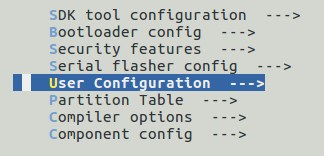
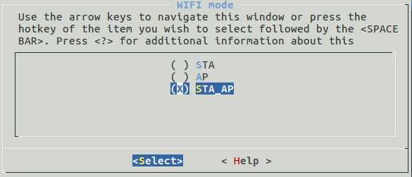
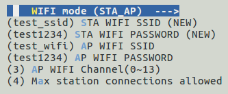

# 1 Brief
ESP32 Wifi Mode: STA/AP/STA+AP

# 2 Wifi config

> make menuconfig

2.1 User Configuration  --->

2.2 Config Wifi Mode:

2.3 set the sta/ap ssid&password

# 3 Build&Flash

> make  
> make flash
